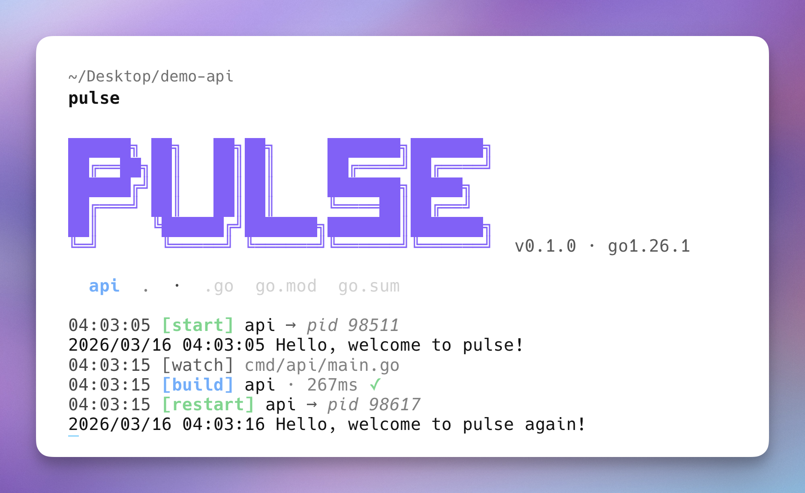

# Pulse

[](https://goreportcard.com/report/github.com/Pratham-Mishra04/pulse)

**Live reload that doesn't kill your server on build errors.**

Fix your code. Your server stays up.



---

## What makes Pulse different

- Your server **stays alive** when builds fail — always a working API, even mid-refactor
- Works out of the box in Docker — no polling config needed
- Automatically watches `go.work` dependencies across monorepos
- Works with **any language or toolchain** — not just Go
- Optional **zero-downtime restarts** for HTTP services with slow startup times

---

## Why Pulse

Most live-reload tools kill your server as soon as a build fails. That means your API goes down, your frontend breaks, and your dev loop gets interrupted — every time you have a compile error.

Pulse does the opposite.

If a build fails, the old process keeps running. You fix the error, save, and continue — no downtime, no disruption.

**Coming from Air?** You'll notice:

- no dead server on build errors
- no manual Docker polling config
- better defaults out of the box

---

## When should you use Pulse?

Pulse is built for:

- Backend APIs you restart frequently during development
- Services with slow startup times (DB connections, cache warmup, model loading)
- Monorepos using `go.work` with shared modules
- Docker-based development setups
- Multi-service local environments

If your dev loop is `edit → build → restart`, Pulse makes it faster and less frustrating.

---

## Installation

```bash
go install github.com/Pratham-Mishra04/pulse@latest
```

Or build from source:

```bash
git clone https://github.com/Pratham-Mishra04/pulse
cd pulse
make install
```

---

## Quick Start

```bash
# In your project root (where go.mod lives):
pulse init ./path/to/watch
# Use . to watch entire project

# Start watching:
pulse
```

`pulse init` generates a `pulse.yaml`. That's it — Pulse is ready.

---

## Not just for Go

Pulse works with any language or toolchain. The `build` and `run` fields are plain shell commands — there is nothing Go-specific about the core watch → build → restart loop.

No build step? No problem — omit `build` and Pulse restarts your process directly on file changes.

**Node.js / TypeScript**

```yaml
version: 1
services:
  server:
    run: node src/index.js
    watch:
      - .js
      - .json
```

```yaml
version: 1
services:
  app:
    build: npx tsc --noEmit
    run: node dist/index.js
    watch:
      - .ts
```

**Python**

```yaml
version: 1
services:
  api:
    run: python app.py
    watch:
      - .py
```

**Fullstack (Go backend + frontend asset pipeline)**

```yaml
version: 1
services:
  api:
    build: go build -o ./tmp/api ./cmd/api
    run: ./tmp/api
    watch: [.go, .templ, go.mod]

  css:
    run: npx tailwindcss -i ./assets/app.css -o ./static/app.css --watch
    watch: [.css, .html, .templ]
    no_stdin: true

  js:
    run: npx esbuild src/main.ts --bundle --outfile=static/app.js --watch
    watch: [.ts, .tsx]
    no_stdin: true
```

The keep-alive behaviour applies equally to all services — if the CSS watcher crashes, the Go API keeps running.

---

## How It Works

On startup, Pulse:

1. Runs the build command immediately (synchronous)
2. Starts the binary
3. Begins watching files for changes

When a watched file changes:

1. Debounce window opens (default 300ms) — rapid saves are coalesced
2. Build runs
3. **If build succeeds** — old process is stopped, new binary is started
4. **If build fails** — error is printed, old process is kept alive

Press Ctrl+C once to gracefully stop your service. Press again to force exit.

---

## Configuration

### pulse.yaml

```yaml
version: 1

services:
  api:
    path: ./cmd/api
    build: go build -o ./tmp/api ./cmd/api
    run: ./tmp/api
```

That's the minimal config. Every other field is optional.

### All Options

```yaml
version: 1

services:
  api:
    # Required
    run: ./tmp/api --port 8080 # command to start the process

    # Optional — omit entirely for plain-process services (no compile step)
    build: go build -o ./tmp/api ./cmd/api # shell command to compile

    # Source location
    path: ./cmd/api # working dir for build (default: project root)

    # File watching
    watch: # extensions/filenames that trigger a rebuild
      - .go
      - .tmpl
      - go.mod
      - go.sum
    ignore: # glob patterns to skip (matched against base filename)
      - "*_mock.go"
      - "*.pb.go"

    # Environment
    env:
      PORT: "8080"
      DB_URL: postgres://localhost/mydb

    # Hooks
    pre: go generate ./... # run before each build
    pre_strict: false # if true, pre failure aborts the build
    post: ./scripts/notify.sh # run after each successful restart
    post_strict: false # if true, post failure logs a hard error

    # Timing
    debounce: 300ms # quiet period before triggering a build
    kill_timeout: 5s # SIGTERM wait before SIGKILL

    # Container / polling
    polling: auto # "auto" | "on" | "off"
    poll_interval: 500ms # tick rate when polling is active

    # Misc
    no_stdin: false # disable stdin forwarding (useful in CI)
    no_workspace: false # disable go.work auto-detection

    # Zero-downtime restarts (optional — proxy and healthcheck must be set together)
    proxy:
      addr: ":8080" # Pulse owns this port; process runs on a dynamic internal port
    healthcheck:
      path: /health # endpoint polled on the internal port
      interval: 1s # poll cadence (default: 1s)
      timeout: 60s # total budget (default: 60s)
      threshold: 1 # consecutive 200s required (default: 1)
```

### Field Reference

| Field                   | Default                 | Description                                                                       |
| ----------------------- | ----------------------- | --------------------------------------------------------------------------------- |
| `build`                 | `""`                    | Shell command to compile the service (optional — omit for plain-process services) |
| `run`                   | required                | Command to start the process                                                      |
| `path`                  | `.`                     | Working directory for the build command                                           |
| `watch`                 | `[.go, go.mod, go.sum]` | Extensions or filenames that trigger a rebuild                                    |
| `ignore`                | `[]`                    | Glob patterns excluded from watching (base filename)                              |
| `env`                   | `{}`                    | Extra environment variables injected into the process                             |
| `pre`                   | `""`                    | Command run before each build                                                     |
| `pre_strict`            | `false`                 | Abort build if `pre` fails                                                        |
| `post`                  | `""`                    | Command run after each successful restart                                         |
| `post_strict`           | `false`                 | Log hard error if `post` fails                                                    |
| `debounce`              | `300ms`                 | Quiet period after last file event before building                                |
| `kill_timeout`          | `5s`                    | Grace period between graceful signal and force-kill                               |
| `polling`               | `"auto"`                | Polling strategy — see [Containers](#containers)                                  |
| `poll_interval`         | `500ms`                 | Tick rate when polling is active                                                  |
| `no_stdin`              | `false`                 | Disable stdin forwarding to child process                                         |
| `no_workspace`          | `false`                 | Disable automatic go.work detection                                               |
| `proxy.addr`            | `""`                    | Public address Pulse binds as a reverse proxy — enables zero-downtime restarts    |
| `healthcheck.path`      | `""`                    | HTTP endpoint polled for readiness (required when `proxy` is set)                 |
| `healthcheck.interval`  | `1s`                    | How often to poll the health endpoint                                             |
| `healthcheck.timeout`   | `60s`                   | Total budget before the health check is considered failed                         |
| `healthcheck.threshold` | `1`                     | Consecutive 200s required before promoting the new process                        |

### Always-Ignored

These are hardcoded and cannot be overridden:

| Path            | Reason                     |
| --------------- | -------------------------- |
| `.git/`         | Version control internals  |
| `vendor/`       | Vendored dependencies      |
| `node_modules/` | JavaScript dependencies    |
| `tmp/`          | Pulse's own build output   |
| `testdata/`     | Go test fixture convention |
| `*_gen.go`      | Generated files            |
| `*.pb.go`       | Protobuf generated files   |

---

## Zero-Downtime Restarts (Proxy Mode)

Services with slow startup times — database connections, model loading, cache warming — have a gap between when the old process stops and the new one is ready. For a server that takes 20 seconds to initialize, every rebuild means 20 seconds of downtime.

Proxy mode eliminates that gap.

```
Old process serves traffic → new process warms up → switch when ready.
```

When enabled, Pulse owns the public port and acts as a reverse proxy. On every rebuild:

1. The new binary starts on a dynamic internal port — the old process keeps serving live traffic
2. Pulse polls your health endpoint until it returns HTTP 200
3. Once healthy, Pulse atomically switches the proxy to the new process — zero gap
4. The old process receives SIGTERM and drains in-flight requests for up to `kill_timeout`

```yaml
version: 1

services:
  api:
    build: go build -o ./tmp/api ./cmd/api
    run: ./tmp/api
    proxy:
      addr: ":8080" # Pulse owns this port
    healthcheck:
      path: /health # polled on the internal port
      interval: 1s # how often to poll (default: 1s)
      timeout: 60s # total budget before giving up (default: 60s)
      threshold: 1 # consecutive 200s required (default: 1)
    kill_timeout: 10s # drain window for the old process
```

Pulse injects `PORT` into the process environment with the dynamic internal port. Your app just reads `os.Getenv("PORT")` — no other changes needed. Any `PORT` value in `env:` is ignored when proxy is active.

> **`proxy` and `healthcheck` must be set together.** One without the other is a hard error at startup.

**What happens if the health check fails?** The new process is killed and the old one keeps serving. A bad deploy never reaches live traffic.

**What happens during the very first startup?** The proxy returns `503` to clients until the initial health check passes. On all subsequent restarts, the old process continues serving throughout the warmup — clients see no errors.

---

## Multi-Service

Run multiple services from a single `pulse.yaml`:

```yaml
version: 1

services:
  api:
    build: go build -o ./tmp/api ./cmd/api
    run: ./tmp/api
    env:
      PORT: "8080"

  worker:
    build: go build -o ./tmp/worker ./cmd/worker
    run: ./tmp/worker
    env:
      QUEUE_URL: amqp://localhost
```

Each service runs in its own goroutine. Log output is prefixed with the service name:

```
14:03:01 [api]    build  230ms ✓
14:03:01 [worker] build  180ms ✓
14:03:01 [api]    start  pid=48291
14:03:01 [worker] start  pid=48292
```

---

## CLI Reference

### `pulse` / `pulse run`

Start watching and rebuilding. Loads `pulse.yaml` from the current directory.

```bash
pulse [flags]
```

For multi-service configs, all services run in parallel. Each service prefixes its log output with its name.

### `pulse init <path>`

Initialize Pulse for a project. Writes `pulse.yaml` and optionally updates `.gitignore`.

```bash
pulse init ./cmd/api
pulse init .          # single-package project in root
```

The service name is derived from the last component of the path. You can edit `pulse.yaml` directly for any changes — `init` is a one-time scaffolding command.

### `pulse migrate <path>`

Migrate an existing Air config to `pulse.yaml`.

```bash
pulse migrate .air.toml
```

Every field mapping is logged. Every dropped field is logged with a reason. Nothing is silently ignored.

Fields that differ between Air and Pulse semantics are noted explicitly — for example, Air's `post_cmd` runs on shutdown while Pulse's `post` runs after each restart.

### `pulse version`

Print version and Go runtime information.

### Global Flags

| Flag         | Short | Default      | Description                                 |
| ------------ | ----- | ------------ | ------------------------------------------- |
| `--config`   | `-c`  | `pulse.yaml` | Path to config file                         |
| `--quiet`    | `-q`  | `false`      | Only show errors and restarts               |
| `--verbose`  | `-v`  | `false`      | Show all file events including ignored ones |
| `--no-color` |       | `false`      | Disable ANSI color output                   |

---

## Containers

Pulse auto-detects when it is running inside a Docker container (or any OCI runtime like Kubernetes, Podman, containerd) and switches to polling automatically.

This is necessary because inotify does not fire for bind-mount changes from the host. Without polling, every file edit made outside the container is silently missed.

**No configuration needed** — auto-detection covers the common case.

If auto-detection misses your setup, force polling on:

```yaml
services:
  api:
    build: go build -o ./tmp/api ./cmd/api
    run: ./tmp/api
    polling: on
    poll_interval: 500ms # default
```

To disable polling even inside a container (if you know inotify works):

```yaml
polling: off
```

---

## Go Workspaces

In a monorepo using `go.work`, changes to shared modules outside the project root normally go undetected. Pulse fixes this automatically.

```
/workspace/
├── api/                  ← run pulse here
│   ├── go.mod
│   ├── go.work           ← references ../shared
│   └── pulse.yaml
└── shared/               ← Pulse watches this too
    └── go.mod
```

Pulse walks up from the working directory to find `go.work`, parses every `use` directive, and adds any directories outside the project root as extra watch roots. A change to `../shared/auth/user.go` triggers a rebuild of `api` automatically.

To opt out:

```yaml
services:
  api:
    build: go build -o ./tmp/api ./cmd/api
    run: ./tmp/api
    no_workspace: true
```

---

## Hooks

### Pre-build hook

Runs before each build. Useful for code generation.

```yaml
services:
  api:
    pre: go generate ./...
    build: go build -o ./tmp/api ./cmd/api
    run: ./tmp/api
```

If `pre` fails, the failure is logged but the build still runs. Set `pre_strict: true` to abort the build on failure (the old process is kept alive, same as a compile error).

### Post-restart hook

Runs after each successful restart. Useful for notifications or smoke tests.

```yaml
services:
  api:
    build: go build -o ./tmp/api ./cmd/api
    run: ./tmp/api
    post: ./scripts/notify-slack.sh
```

The running process is never killed due to a `post` failure. Set `post_strict: true` to log a hard error when `post` fails.

---

## Environment Variables

```yaml
services:
  api:
    build: go build -o ./tmp/api ./cmd/api
    run: ./tmp/api
    env:
      PORT: "8080"
      DB_DSN: postgres://localhost/mydb
      LOG_LEVEL: debug
```

Extra vars are merged on top of the parent process environment. If a key already exists in the environment, the value from `env:` wins.

---

## Migrating from Air

```bash
pulse migrate .air.toml
```

Pulse reads your `.air.toml` and generates an equivalent `pulse.yaml`. Every field is either mapped or explicitly explained:

```
reading .air.toml...
mapped    build.cmd              → build: go build -o ./tmp/api ./cmd/api
mapped    build.bin (deprecated) → run: ./tmp/api
mapped    build.delay            → debounce: 1s
note      build.delay            Air default (1000ms) mapped; Pulse default is 300ms — consider lowering
ignored   build.stop_on_error    (Pulse always keeps the old process alive on build failure)
ignored   [proxy]                (browser reload proxy is not supported in Pulse)
```

**Key differences from Air:**

| Air                    | Pulse           | Note                                                      |
| ---------------------- | --------------- | --------------------------------------------------------- |
| `stop_on_error = true` | (not supported) | Pulse always keeps the old process alive on build failure |
| `post_cmd`             | `post`          | Air runs on shutdown; Pulse runs after each restart       |
| `exclude_regex`        | `ignore`        | Pulse uses glob patterns, not regular expressions         |
| `include_dir`          | (not needed)    | Pulse watches the project root recursively                |
| `env_files`            | (not supported) | Use `direnv` or set vars under `env:`                     |
| `rerun`                | (not supported) | Auto-rerun on exit is not implemented                     |

---

## Examples

The `examples/` directory contains ready-to-use configs:

| File                 | Description                                       |
| -------------------- | ------------------------------------------------- |
| `simple.yaml`        | Minimal single-service config                     |
| `full.yaml`          | Every option with explanations                    |
| `multi-service.yaml` | API + background worker                           |
| `fullstack.yaml`     | Go backend + frontend build watcher               |
| `workspace.yaml`     | `go.work` monorepo setup                          |
| `docker.yaml`        | Docker bind-mount with forced polling             |
| `env-vars.yaml`      | Environment variable injection                    |
| `hooks.yaml`         | Pre/post hook patterns                            |
| `proxy.yaml`         | Zero-downtime restarts with proxy + healthcheck   |
| `custom-watch.yaml`  | Watching `.tmpl`, `.html`, and other non-Go files |
| `ci.yaml`            | CI environment (no stdin, no color)               |
| `tuning.yaml`        | Debounce and kill-timeout tuning                  |

---

## Development

```bash
make build     # compile to ./tmp/pulse
make install   # install to $GOPATH/bin
make test      # unit tests
make e2e       # end-to-end tests (spawns real processes)
make test-all  # unit + e2e
make lint      # go vet
make tidy      # go mod tidy + verify
make snapshot  # cross-compile for Linux, macOS (arm64/amd64), Windows
```

---

## Platform Support

| Platform             | Status                   |
| -------------------- | ------------------------ |
| macOS (arm64, amd64) | Supported                |
| Linux (amd64, arm64) | Supported                |
| Windows (amd64)      | Supported                |
| Inside Docker        | Supported (auto-polling) |
| Kubernetes pods      | Supported (auto-polling) |

### Windows Notes

- **Installation**: `go install github.com/Pratham-Mishra04/pulse@latest` works the same as on Unix. You can build Windows `.exe` artifacts locally with `make snapshot`.
- **Graceful shutdown**: Pulse sends `CTRL_BREAK_EVENT` to the child process on shutdown — the Windows equivalent of SIGTERM. Child processes can intercept it via [`SetConsoleCtrlHandler`](https://learn.microsoft.com/en-us/windows/console/setconsolectrlhandler). If the signal is delivered but the child does not exit within `kill_timeout`, Pulse falls back to `taskkill /F /T`; if signal delivery itself fails (e.g. the process has a different console), Pulse force-kills immediately.
- **Ctrl+C**: Works as expected — first press triggers a graceful shutdown, second press force-exits.
- **Shell commands**: `build`, `run`, `pre`, and `post` values are passed to the OS as-is. Use `cmd /C <command>` if you need Windows shell builtins (e.g. `cmd /C del tmp\out.exe`).

---

## License

MIT
